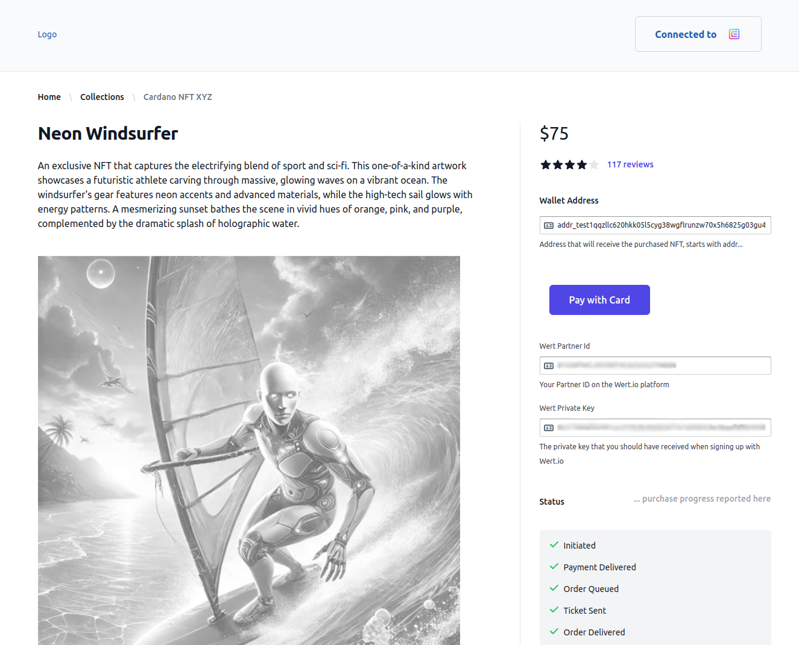
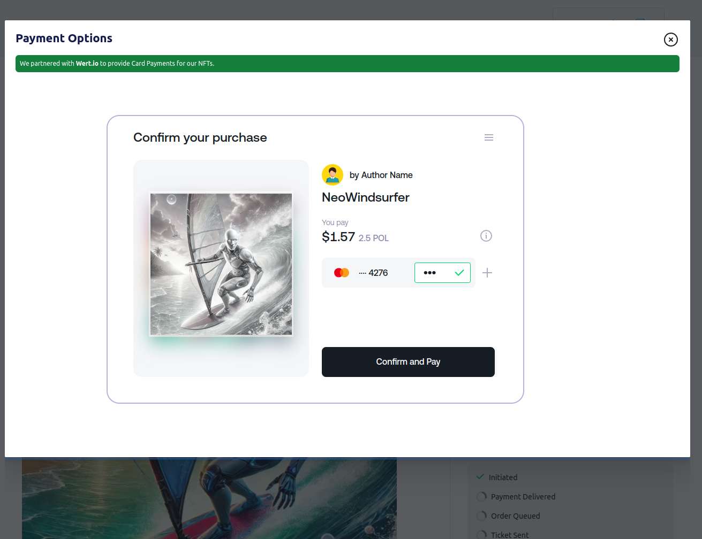
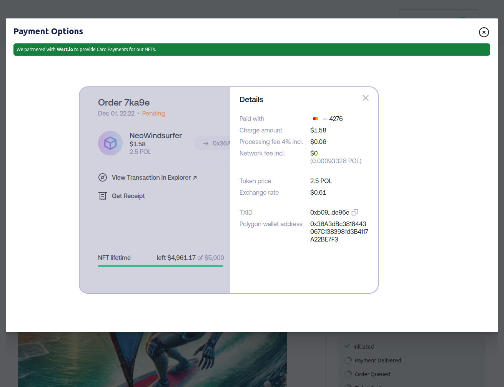
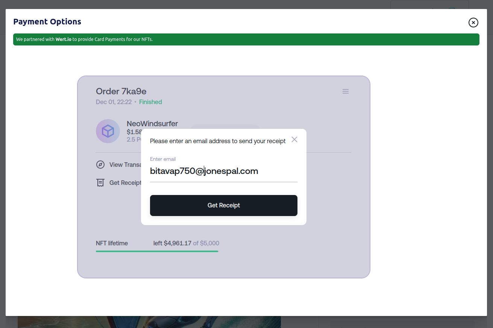
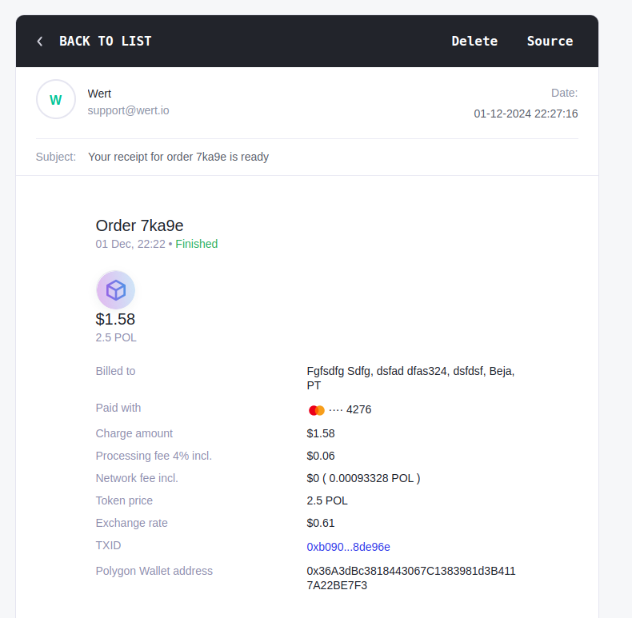

> [!IMPORTANT]  
> This is a Work in progress

<!-- PROJECT LOGO -->
<br />
<div align="center">
  <a href="https://github.com/othneildrew/Best-README-Template">
    
  </a>

<h3 align="center">Cardano Card Gateway</h3>
<a href="https://cardgateway.work.gd">Demo</a>
</div>


<!-- TABLE OF CONTENTS -->
<details>
  <summary>Table of Contents</summary>
  <ol>
    <li>
      <a href="#about-the-project">About The Project</a>
      <ul>
        <li><a href="#built-with">Built With</a></li>
      </ul>
    </li>
    <li>
      <a href="#getting-started">Getting Started</a>
      <ul>
        <li><a href="#prerequisites">Prerequisites</a></li>
        <li><a href="#installation">Installation</a></li>
      </ul>
    </li>
    <li><a href="#usage">Usage</a></li>
    <li><a href="#license">License</a></li>
    <li><a href="#acknowledgments">Acknowledgments</a></li>
  </ol>
</details>

## Built With

Major frameworks/libraries used in this project.

[![Next][Next.js]][Next-url] [![ReactJS][ReactJS]][ReactJS-url] [![Axios][Axios]][Axios-url] [![MobX][MobX]][MobX-url]
[![Tailwindcss][Tailwindcss]][Tailwindcss-url] [![Node][Node.js]][Node-url] [![PM2][PM2]][PM2-url]
[![MongoDB][MongoDB]][MongoDB-url] [![Mongoose][Mongoose]][Mongoose-url] [![Ethers][Ethers]][Ethers-url]
[![Polygon][Polygon]][Polygon-url] [![Cardano][Cardano]][Cardano-url]
* Dynamic Strategies
* Wert.io
* MeshJS

<!-- ABOUT THE PROJECT -->
## 1 - About The Project

This is a cross chain collaboration between Cardano and the Polygon blockchains.
The codebase includes components for:
- Accepting card payments for digital assets using an EVM payment processor
- Receiving the payment into a smart contract on a Polygon network
- Sending Digital Assets to the buyer on the Cardano network


### Demo
Demo of a sample shop-front with a "Pay with Card" button will be shown here 
<a href="https://cardgateway.work.gd">cardgateway.work.gd</a>

#### Shopfront

Below is an example printscreen of a shopfront displaying a Digital Asset,
a Wallet Connector to connect to the user's Cardan Wallet and the Payment processor.
When a user pressed the "Pay with Card" button this will launch the payment processor
shown in the next step



#### Payment Processor

The credit card payments are handle by <a href="https://wert.io/">Wert.io</a> and the code based in
this repo implemnents the connection between an example webiste and their payment
processing services. Additionally, they only provide automation for payments of digital assets
minted on EVM blockchains, so an additional functionality is implemented that monitors for
minting of these assets on the EVM chain and sends the user of the asset on the Cardano blockchain

Printscreens of the payment processor screen when a user clicks on the "Pay with Card" button
on the storefront and then as the user steps through the payment with a final receipt on email
at the end.

<div style="flex">
    
    
    
    
</div>


## 2 - Components

### 2.1 - Frontend Storefront
The frontend is built with `NextJS` and includes a Wallet connector to Cardano `Nami` and `Eternl` wallets.
Other Cardano wallets can be added few lines of code.

#### 2.1.x - Environment Variables
The environment variable controls the execution of the component and needs to be adjusted for every implementation
The list of environment variables and their purpose is described in this table

| **Environment Variable** | **Description** | **Example**                             |
|---|---|-----------------------------------------|
| MONGODB_URL | The path to a MongpDB instance running on your machine, or an another server. This can also be running in a separate docker container in which case you will need to adjust the localhost to point to the container name | mongodb://localhost:27048               |
| MONGODB_DB | The database name that will be used in MongoDB. This database will be created during the first transaction if it doesn't exist | cgateway                                |
| ASSET_POLICY_ID | PolicyID of the Asset name on the Cardano blockchain that is being sold on the  storefront. This asset will be delivered to the user | 8b6e0...289e1c8d                        |
| ASSET_NAME | Asset Name on the Cardano blockchain from the policy Id above that is being sold on the  storefront. This asset will be delivered to the user | NeoWindsurfer                           |
| ASSET_IMG_SRC | Image of the Asset to display during the check-out in the payment processor's screen | https://res.cloudinary.com/...6ucka.png |
| WERT_WEBHOOK_API | The path to the API services, most of the time can be left unchanged | http://localhost:3000/api               |
| WERT_FEE_PERC | The amount that is paid to the payment processor as a fee. This will be determined in the contract that will need to be signed with the payment processor before going live on the mainnet | 0.04                                    |
| WERT_COMMODITY | The token symbol which will be transferred to you by the payment processor (wert.io) when users purchase digital assets through the storefront | POL                                     |
| WERT_NETWORK | The name of the network on the Polygon blockchain where the payments will be made to (e.g. Polygon Amoy is the testnet) | amoy                                    |
| WERT_PAYTO_WALLET | Your wallet address on the Poolygon blockchain where the minted Digital Assets will be sent when the user makes a purchase in the storefront | 0x36A3dBc381...17A22BE7F3               |
| EVM_SC_ADDRESS | The EVM smart contract address on the Polygon blockchain into which the payment processor will make the payment | 0xDB6Ca39D1...9F8985Ae81311fc           |
| ASSET_POL_PRICE | The price of the Digital Asset being sold on the storefront. The price needs to be given in POL tokens | 2.5                                     |

### 2.2 - Backend Services
There are 4 main backend services

#### 2.2.1 - The APIs
There ate

#### 2.2.1 - MongoDB
The backend database holds information on orders that were initiated through the front end.
It should be launched by as docker container alongside the front end and the daemon service.
And example is provided in the `docker-compose.yml` in the main directory. This is the
relevant section in that file that launches the docker container with MongoDB:

```yaml
version: "3.5"

services:
  TESTNET_cgateway_mongodb:
    container_name: TESTNET_cgateway_mongodb
    image: mongo:6.0.19
    command: mongod --port 27047
    restart: always
    volumes:
      - mongodb-cgateway:/data/db
    ports:
      - 127.0.0.1:27047:27047

volumes:
  mongodb-cgateway:
```


#### 2.2.x - Environment Variables

| **Environment Variable** | **Description**                                                                                                                                                                                                          | **Example**                       |
|---|--------------------------------------------------------------------------------------------------------------------------------------------------------------------------------------------------------------------------|-----------------------------------|
| NETWORK | The Cardano network on which the platform is being run, there are two testnets: "preview" and "preprod", and the then the "mainnet"                                                                                      | preview                           |
| MONGODB_URL | The path to a MongpDB instance running on your machine, or an another server. This can also be running in a separate docker container in which case you will need to adjust the localhost to point to the container name | mongodb://localhost:27048         |
| MONGODB_DB | The database name that will be used in MongoDB. This database will be created during the first transaction if it doesn't exist                                                                                           | cgateway                          |
| HOT_WALLET_ADDRESS | The Cardano Hot wallet address where the assets held for distribiution to the users. A back end service monitors for payment receipts and then sends the assets from this wallet                                         | addr_test1qpuq...wr3q0u93y9       |
| HOT_WALLET_PRVKEY | The Private key for the hot wallet. Make sure to keep this key safe as who ever has access to this key, has access to the contents of the wallet                                                                         | xprv...vcfz              |
| EVM_RPC | Address to the Indexer of the EVM blockchain. You can find a list of available indexers for different blockchains here https://chainlist.org/chain/80002                                                                                                  | https://rpc.ankr.com/polygon_amoy |


#### 2.2.x - Bonus: Test Wallet generator
An additional API was used in testing to generate wallets on the Cardano testnet. This is available at the
`/api/walletgenerator` endpoint and a demo of its is running at `https://cardgateway.work.gd/api/walletgenerator`
This should only be used for testing

### EVM Smart Contract


### Payment Processor


<!-- GETTING STARTED -->
## 3 - Getting Started


### Prerequisites

This is an example of how to list things you need to use the software and how to install them.
* npm
  ```sh
  
  ```

### Installation

1. Clone the repo
   ```sh
   git clone https://github.com/dynamicstrategies/cardano-card-gateway.git
   ```
2. Install NPM packages
   ```sh
   
   ```
   
3. Run the dev environment
    ```sh

   ```

### Environment Variables


<!-- USAGE EXAMPLES -->
## 4 - Usage

Get the Metamask Browser Extension
Create a wallet and connect to the Polygon Amoy network. You can use this website to do this
```shell
https://chainlist.org/chain/80002
```

Get test "POL" token from this faucet `https://faucet.polygon.technology/`
You will need to connect with your Discord server to request the test tokens on the website


## Deploy EVM Smart Contract
Access Remix `https://remix.ethereum.org/`


## Testing

Test with card details as described here `https://docs.wert.io/docs/sandbox`


<!-- LICENSE -->
## License

Distributed under the Apache 2.0 License See `LICENSE.txt` for more information.


<!-- ACKNOWLEDGMENTS -->
## Acknowledgments


<!-- MARKDOWN LINKS & IMAGES -->
[product-screenshot]: images/screenshot.png
[Next.js]: https://img.shields.io/badge/next.js-000000?style=for-the-badge&logo=nextdotjs&logoColor=white
[Next-url]: https://nextjs.org/
[Tailwindcss]: https://img.shields.io/badge/tailwindcss-06B6D4?style=for-the-badge&logo=tailwindcss&logoColor=white
[Tailwindcss-url]: https://tailwindcss.com/
[Node.js]: https://img.shields.io/badge/nodedotjs-5FA04E?style=for-the-badge&logo=nodedotjs&logoColor=white
[Node-url]: https://nodejs.org/
[PM2]: https://img.shields.io/badge/pm2-2B037A?style=for-the-badge&logo=pm2&logoColor=white
[PM2-url]: https://pm2.keymetrics.io/
[MongoDB]: https://img.shields.io/badge/mongodb-47A248?style=for-the-badge&logo=mongodb&logoColor=white
[MongoDB-url]: https://www.mongodb.com/
[Mongoose]: https://img.shields.io/badge/mongoose-880000?style=for-the-badge&logo=mongoose&logoColor=white
[Mongoose-url]: https://mongoosejs.com/
[Ethers]: https://img.shields.io/badge/ethers-2535A0?style=for-the-badge&logo=ethers&logoColor=white
[Ethers-url]: https://docs.ethers.org/v6/
[Cardano]: https://img.shields.io/badge/cardano-0133AD?style=for-the-badge&logo=cardano&logoColor=white
[Cardano-url]: https://cardano.org/
[Polygon]: https://img.shields.io/badge/polygon-7B3FE4?style=for-the-badge&logo=polygon&logoColor=white
[Polygon-url]: https://polygon.technology/
[Axios]: https://img.shields.io/badge/axios-5A29E4?style=for-the-badge&logo=axios&logoColor=white
[Axios-url]: https://axios-http.com/
[ReactJS]: https://img.shields.io/badge/react-5A29E4?style=for-the-badge&logo=react&logoColor=white
[ReactJS-url]: https://react.dev/
[MobX]: https://img.shields.io/badge/mobx-5A29E4?style=for-the-badge&logo=mobx&logoColor=white
[MobX-url]: https://mobx.js.org/


