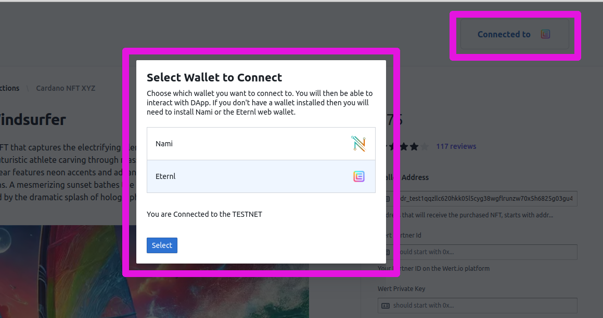

> [!IMPORTANT]  
> This is a Work in progress

<!-- PROJECT LOGO -->
<br />
<div align="center">
  <a href="https://github.com/othneildrew/Best-README-Template">
    
  </a>

<h3 align="center">Cardano Card Gateway</h3>
<a href="https://cardgateway.work.gd">Demo</a>
</div>


<!-- TABLE OF CONTENTS -->
<details>
  <summary>Table of Contents</summary>
  <ol>
    <li>
      <a href="#about-the-project">About The Project</a>
      <ul>
        <li><a href="#built-with">Built With</a></li>
      </ul>
    </li>
    <li>
      <a href="#getting-started">Getting Started</a>
      <ul>
        <li><a href="#prerequisites">Prerequisites</a></li>
        <li><a href="#installation">Installation</a></li>
      </ul>
    </li>
    <li><a href="#usage">Usage</a></li>
    <li><a href="#license">License</a></li>
    <li><a href="#acknowledgments">Acknowledgments</a></li>
  </ol>
</details>

## Built With

Major frameworks/libraries used in this project.

[![Next][Next.js]][Next-url] [![ReactJS][ReactJS]][ReactJS-url] [![Axios][Axios]][Axios-url] [![MobX][MobX]][MobX-url]
[![Tailwindcss][Tailwindcss]][Tailwindcss-url] [![Node][Node.js]][Node-url] [![PM2][PM2]][PM2-url]
[![MongoDB][MongoDB]][MongoDB-url] [![Mongoose][Mongoose]][Mongoose-url] [![Ethers][Ethers]][Ethers-url]
[![Polygon][Polygon]][Polygon-url] [![Cardano][Cardano]][Cardano-url]
* Dynamic Strategies
* Wert.io
* MeshJS

<!-- ABOUT THE PROJECT -->
## 1 - About The Project

This is a cross chain collaboration between Cardano and the Polygon blockchains.
The codebase includes components for:
- Accepting card payments for digital assets using an EVM payment processor
- Receiving the payment into a smart contract on a Polygon network
- Sending Digital Assets to the buyer on the Cardano network

If you want to contribute this repo then make yourself known with a pull request, or a
suggested enhancement via the issue tracker

### Demo
Demo of a sample shop-front with a "Pay with Card" button will be shown here 
<a href="https://cardgateway.work.gd">cardgateway.work.gd</a>

#### Shopfront

Below is an example printscreen of a shopfront displaying a Digital Asset,
a Wallet Connector to connect to the user's Cardan Wallet and the Payment processor.
When a user pressed the "Pay with Card" button this will launch the payment processor
shown in the next step


#### Payment Processor

The credit card payments are handle by <a href="https://wert.io/">Wert.io</a> and the code based in
this repo implemnents the connection between an example webiste and their payment
processing services. Additionally, they only provide automation for payments of digital assets
minted on EVM blockchains, so an additional functionality is implemented that monitors for
minting of these assets on the EVM chain and sends the user of the asset on the Cardano blockchain

Printscreens of the payment processor screen when a user clicks on the "Pay with Card" button
on the storefront and then as the user steps through the payment with a final receipt on email
at the end.

<div style="flex">
    
    
    
    
</div>


## 2 - Components
The codebase is made up of 4 components: Frontend, Backend, EVM Smart contract and the Payment processor.
Each one of these is described in the subsections below.

### 2.1 - Frontend Storefront
The frontend is built with `NextJS`. It is frontend framework that builds on top of ReactJS and extends by
adding features such as Server Side Rendering (SSR) and inbuilt API support. It is used by some of the 
world's largest companies and has extensive documentation. It also has backend functionality which is discussed
in a separate section on the backend

The codebase for the frontend is stored in the `/nextjs` directory within the main folder. Refer to the section

#### 2.1.1 - Cardano Wallet Connector
The frontend includes a Wallet connector to Cardano `Nami` and `Eternl` wallets and to `Koios` blockchain indexer
to retrieve the current state of transactions. Other Cardano wallets can be added with a few lines of code. The wallet
connector is used for the user to connect to the storefront and populate their wallet address where the purchased
digital assets should be sent




#### 2.1.x - Environment Variables
The environment variable controls the execution of the component and needs to be adjusted for every implementation
The list of environment variables and their purpose is described in this table

| **Environment Variable** | **Description**                                                                                                                                                                                                                              | **Example**                             |
|---|----------------------------------------------------------------------------------------------------------------------------------------------------------------------------------------------------------------------------------------------|-----------------------------------------|
| MONGODB_URL | The path to a MongpDB instance running on your machine, or an another server. This can also be running in a separate docker container in which case you will need to adjust the localhost to point to the container name                     | mongodb://localhost:27048               |
| MONGODB_DB | The database name that will be used in MongoDB. This database will be created during the first transaction if it doesn't exist                                                                                                               | cgateway                                |
| ASSET_POLICY_ID | PolicyID of the Asset name on the Cardano blockchain that is being sold on the  storefront. This asset will be delivered to the user                                                                                                         | 8b6e0...289e1c8d                        |
| ASSET_NAME | Asset Name on the Cardano blockchain from the policy Id above that is being sold on the  storefront. This asset will be delivered to the user                                                                                                | NeoWindsurfer                           |
| ASSET_IMG_SRC | Image of the Asset to display during the check-out in the payment processor's screen                                                                                                                                                         | https://res.cloudinary.com/...6ucka.png |
| WERT_WEBHOOK_API | The path to the API services, most of the time can be left unchanged                                                                                                                                                                         | http://localhost:3000/api               |
| WERT_FEE_PERC | The amount that is paid to the payment processor as a fee. This will be determined in the contract that will need to be signed with the payment processor before going live on the mainnet. The fee structure is discussed in wert.io FAQs: https://docs.wert.io/docs/general-faq | 0.04                                    |
| WERT_COMMODITY | The token symbol which will be transferred to you by the payment processor (wert.io) when users purchase digital assets through the storefront                                                                                               | POL                                     |
| WERT_NETWORK | The name of the network on the Polygon blockchain where the payments will be made to (e.g. Polygon Amoy is the testnet)                                                                                                                      | amoy                                    |
| WERT_PAYTO_WALLET | Your wallet address on the Poolygon blockchain where the minted Digital Assets will be sent when the user makes a purchase in the storefront                                                                                                 | 0x36A3dBc381...17A22BE7F3               |
| EVM_SC_ADDRESS | The EVM smart contract address on the Polygon blockchain into which the payment processor will make the payment                                                                                                                              | 0xDB6Ca39D1...9F8985Ae81311fc           |
| ASSET_POL_PRICE | The price of the Digital Asset being sold on the storefront. The price needs to be given in POL tokens                                                                                                                                       | 2.5                                     |

### 2.2 - Backend Services

#### 2.2.1 - The APIs
There are three APIs that are part of the NextJS framework. They are used manage the interaction with the payment processor.
One of the advantages of using the NextJS framework is that it has an API functionality built in:

- `nextjs/api/wert-payment-intent.js` - the API endpoint accepts POST requests from the frontend, adds
  information on the EVM smart contract where the payment should be
  made and the price of the digital asset in POL tokens and then
  returns back a signature, signed with a Wert Private Key (that
  is generated during onboarding to Wert.io). For a list inputs and outputs consult the comments
in the file


- `nextjs/api/wert-webhook.js` - the API endpoint receives payment confirmations from the
  payment processor (wert.io) and updates the order status in
  the MongoDB database. When setting up the payment processor, the user should point to
this API endpoint in the processor's web interface to send order
status updates. The API endpoint accepts POST requests coming in and searches for
the field "type" to be equal to "order_complete" or "transfer_started".
The orderId is identified by the "click_id" from the payment processor
In each of these cases it will update the order status by updating the
status in the DB. Once the status is updated, it will then be seen by
the backend Daemon service to decide how to proceed with the order.


- `nextjs/api/orders.js` - the API point accepts POST request from the frontend and deals
  with writing new orders to the DB and updating the status of existing orders The list of available methods are:
  - "neworder" - create a new order in the database when a user
    presses Pay with Card in the frontend
  - "get_status" - to get the status of the current order. This is
    used in the frontend to update the user of their payment and order
    delivery status
  - "get_senttxhash" - to get the hash of the transaction on the
    Cardano blockchain that shows the digital asset being sent to the user's
    wallet. This transaction is sent by the backend daemon once it
    confirms that the payment has been received in the smart contract from Wert.io


#### 2.2.2 - MongoDB
The backend database holds information on orders that were initiated through the frontend.
It should be launched by as docker container alongside the frontend and the daemon service.
And example is provided in the `docker-compose.yml` in the main directory. This is the
relevant section in that file that launches the docker container with MongoDB:

```yaml
version: "3.5"

services:
  TESTNET_cgateway_mongodb:
    container_name: TESTNET_cgateway_mongodb
    image: mongo:6.0.19
    command: mongod --port 27047
    restart: always
    volumes:
      - mongodb-cgateway:/data/db
    ports:
      - 127.0.0.1:27047:27047

volumes:
  mongodb-cgateway:
```

#### 2.2.3 - Daemon

This Daemon is responsible for monitoring payments and sending assets
on the Cardano Network. It is organized in 5 steps:

1 - Initialize connections to the database, connect to a Cardano blockchain
indexed (e.g. Koios https://koios.rest/), and set-up a wallet from where to
send transactions. And a connection to the EVM blockchain to monitor that payment
iss delivered into the smart contract

2 - Check that payment has been received for the assets. This is done by
periodically checking (e.g. every 5 seconds) the status of all orders
that have been registered in the database. And then for the orders
where the payment processor has confirmed payment, further check by
querying the EVM transaction that it was done with the right smart contract
and for the right amount

3 - Once the payment has been confirmed by the payment processor
and independently checked on the EVM blockchain by the daemon, the next step
is to build the transaction and send it to the user's Cardano wallet

4 - Continuously check for order delivery to the user by checking
the state of the transaction on the Cardano blockchain. Once the
transaction has been confirmed, update the DB. This will then
be picked up by the frontend and shown to the user that the transaction
has been delivered to their wallet

5 - Check for transactions that have been pending for a long time and
mark those for which payment has not been received in 24 hours as failed
After this point the daemon will stop continuously checking for their
status

memo: the order status has 5 stages:
- initiated - when the user has requested to Pay with Card for an order
- transfer_started - when payment processor received the order
- paid - when user paid for the order and payment processor has paid you
- sent - when the ticket has been sent to the user into their Cardano wallet
- delivered - when the order has been delivered to the user's Cardano wallet

The daemon monitors for each of the above stages


#### 2.2.4 - Environment Variables

These enviroment variable are defined in the `/daemon/.env` file when run in the development environment
and in the `docker-compose.yml` when deployed in a docker container on the server

| **Environment Variable** | **Description**                                                                                                                                                                                                          | **Example**                       |
|---|--------------------------------------------------------------------------------------------------------------------------------------------------------------------------------------------------------------------------|-----------------------------------|
| NETWORK | The Cardano network on which the platform is being run, there are two testnets: "preview" and "preprod", and the then the "mainnet"                                                                                      | preview                           |
| MONGODB_URL | The path to a MongpDB instance running on your machine, or an another server. This can also be running in a separate docker container in which case you will need to adjust the localhost to point to the container name | mongodb://localhost:27048         |
| MONGODB_DB | The database name that will be used in MongoDB. This database will be created during the first transaction if it doesn't exist                                                                                           | cgateway                          |
| HOT_WALLET_ADDRESS | The Cardano Hot wallet address where the assets held for distribiution to the users. A back end service monitors for payment receipts and then sends the assets from this wallet                                         | addr_test1qpuq...wr3q0u93y9       |
| HOT_WALLET_PRVKEY | The Private key for the hot wallet. Make sure to keep this key safe as who ever has access to this key, has access to the contents of the wallet                                                                         | xprv...vcfz              |
| EVM_RPC | Address to the Indexer of the EVM blockchain. You can find a list of available indexers for different blockchains here https://chainlist.org/chain/80002                                                                                                  | https://rpc.ankr.com/polygon_amoy |


#### 2.2.5 - Bonus: Test Wallet generator
An additional API was used in testing to generate wallets on the Cardano testnet. This is available at the
`/api/walletgenerator` endpoint and a demo of its is running at `https://cardgateway.work.gd/api/walletgenerator`
This should only be used for testing

### 2.3 - EVM Smart Contract

...

### 2.4 - Payment Processor

...


<!-- GETTING STARTED -->
## 3 - Getting Started


### 3.1 - Prerequisites

> [!IMPORTANT]  
> Working knowledge of Javascript frontend and backend is required to progress through this codebase
> Basic familiarity is also assumed with MongoDB, DevOps and particulary Docker, and Cardano and EVM blockchain
> concepts


To develop on the codebase and launch the project you will need:
- A Javascript desktop development environment IDE. We tend to prefer `WebStorm` by IntelliJ for all our needs
- A linux server, capable of running Docker containers and accessible from the web
- Docker conatiners built for the NextJS and the Daemon. The Docker files to build these are provided in their respective
directories
- A Sandbox account with the payment processor `Wert.io`. Visit `https://wert.io/` to request a Sanbox account and `https://docs.wert.io/docs/introduction` do additional documentation and resources to help with integration.

### 3.2 - Installation

Clone the github repo and install the components for local development. Then build the docker containers and deploy
with Docker Compose.

1. Clone the repo
   
  ```sh
   git clone https://github.com/dynamicstrategies/cardano-card-gateway.git
   ```
   
The code base is split into 3 sections, each one with its own folder:

- `/nextjs` with the frontend and API services
- `/daemon` with the backend services
- `/evm_sc` with the EVM Smart Contract template


2. Install NPM packages

To install the frontend from the main directory
   ```sh
   cd nextjs
   npm install
   ```

To install the backend services from the main directory
   ```sh
   cd daemon
   npm install
   ```
   
3. Run the dev environment

Check and adjust the Enviroment variables for your set-up. When running in development these are stored in
`.env` files in `\nextjs` and the `\daemon` folders. And when running in docker containers these are set in
the `docker-compose.yml` files

For the frontend
   ```sh
   cd nextjs
   npm run dev
   ```
Then you can access frontend with a web browser on `https://localhost:3000` on your local machine

For the backend, to launch the daemon that will monitor the DB and send assets from the hot wallet to
the users
   ```sh
   cd daemon
   node daemons/SendOrders.js
   ```


4. Build docker containers

...

<!-- USAGE EXAMPLES -->
## 4 - Usage

Get the Metamask Browser Extension
Create a wallet and connect to the Polygon Amoy network. You can use this website to do this
```shell
https://chainlist.org/chain/80002
```

Get test "POL" token from this faucet `https://faucet.polygon.technology/`
You will need to connect with your Discord server to request the test tokens on the website


## Deploy EVM Smart Contract
Access Remix `https://remix.ethereum.org/`


## Testing

Test with card details as described here `https://docs.wert.io/docs/sandbox`


<!-- LICENSE -->
## License

Distributed under the Apache 2.0 License See `LICENSE.txt` for more information.


<!-- ACKNOWLEDGMENTS -->
## Acknowledgments


<!-- MARKDOWN LINKS & IMAGES -->
[product-screenshot]: images/screenshot.png
[Next.js]: https://img.shields.io/badge/next.js-000000?style=for-the-badge&logo=nextdotjs&logoColor=white
[Next-url]: https://nextjs.org/
[Tailwindcss]: https://img.shields.io/badge/tailwindcss-06B6D4?style=for-the-badge&logo=tailwindcss&logoColor=white
[Tailwindcss-url]: https://tailwindcss.com/
[Node.js]: https://img.shields.io/badge/nodedotjs-5FA04E?style=for-the-badge&logo=nodedotjs&logoColor=white
[Node-url]: https://nodejs.org/
[PM2]: https://img.shields.io/badge/pm2-2B037A?style=for-the-badge&logo=pm2&logoColor=white
[PM2-url]: https://pm2.keymetrics.io/
[MongoDB]: https://img.shields.io/badge/mongodb-47A248?style=for-the-badge&logo=mongodb&logoColor=white
[MongoDB-url]: https://www.mongodb.com/
[Mongoose]: https://img.shields.io/badge/mongoose-880000?style=for-the-badge&logo=mongoose&logoColor=white
[Mongoose-url]: https://mongoosejs.com/
[Ethers]: https://img.shields.io/badge/ethers-2535A0?style=for-the-badge&logo=ethers&logoColor=white
[Ethers-url]: https://docs.ethers.org/v6/
[Cardano]: https://img.shields.io/badge/cardano-0133AD?style=for-the-badge&logo=cardano&logoColor=white
[Cardano-url]: https://cardano.org/
[Polygon]: https://img.shields.io/badge/polygon-7B3FE4?style=for-the-badge&logo=polygon&logoColor=white
[Polygon-url]: https://polygon.technology/
[Axios]: https://img.shields.io/badge/axios-5A29E4?style=for-the-badge&logo=axios&logoColor=white
[Axios-url]: https://axios-http.com/
[ReactJS]: https://img.shields.io/badge/react-5A29E4?style=for-the-badge&logo=react&logoColor=white
[ReactJS-url]: https://react.dev/
[MobX]: https://img.shields.io/badge/mobx-5A29E4?style=for-the-badge&logo=mobx&logoColor=white
[MobX-url]: https://mobx.js.org/


