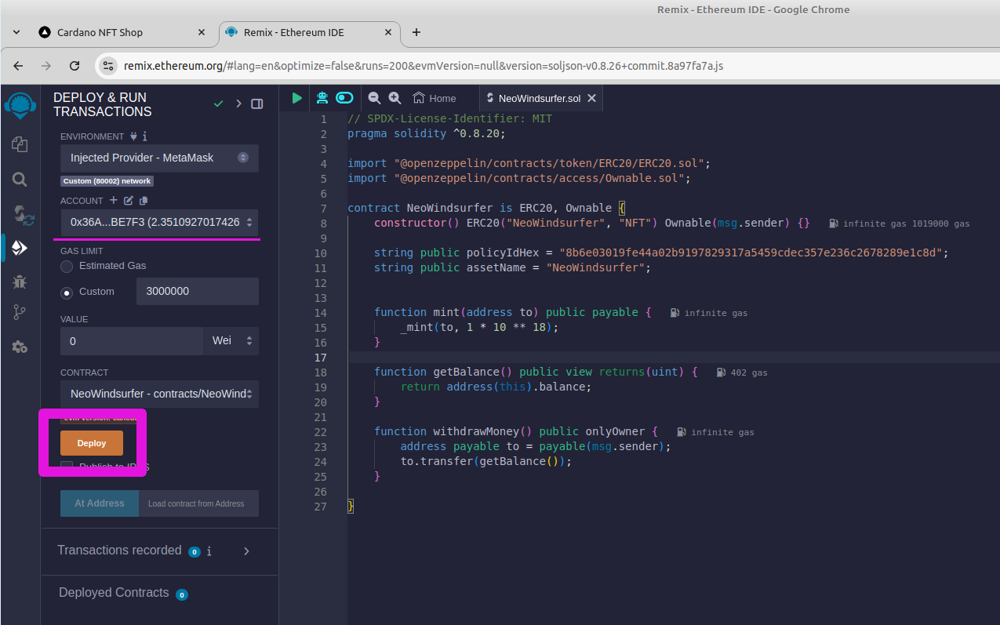

> [!IMPORTANT]  
> This is a Work in progress

<!-- PROJECT LOGO -->
<br />
<div align="center">
  <a href="">
    
  </a>
</div>

<!-- TABLE OF CONTENTS -->
<details>
  <summary>Table of Contents</summary>
  <ol>
    <li>
      <a href="#about-the-project">About The Project</a>
      <ul>
        <li><a href="#built-with">Built With</a></li>
      </ul>
    </li>
    <li>
      <a href="#getting-started">Getting Started</a>
      <ul>
        <li><a href="#prerequisites">Prerequisites</a></li>
        <li><a href="#installation">Installation</a></li>
      </ul>
    </li>
    <li><a href="#usage">Usage</a></li>
    <li><a href="#license">License</a></li>
    <li><a href="#acknowledgments">Acknowledgments</a></li>
  </ol>
</details>

## Built With

Major frameworks/libraries used in this project.

[![Next][Next.js]][Next-url] [![ReactJS][ReactJS]][ReactJS-url] [![Axios][Axios]][Axios-url] [![MobX][MobX]][MobX-url]
[![Tailwindcss][Tailwindcss]][Tailwindcss-url] [![Node][Node.js]][Node-url] [![PM2][PM2]][PM2-url]
[![MongoDB][MongoDB]][MongoDB-url] [![Mongoose][Mongoose]][Mongoose-url] [![Ethers][Ethers]][Ethers-url]
[![Polygon][Polygon]][Polygon-url] [![Ethereum][Ethereum]][Ethereum-url] [![Cardano][Cardano]][Cardano-url]
* Dynamic Strategies
* Wert.io
* MeshJS

<!-- ABOUT THE PROJECT -->
## 1 - About The Project

This is a cross chain collaboration between Cardano and EVM blockchains with a fiat onramp

The codebase includes components for:
- Accepting card payments for Digital Assets using an EVM payment processor
- Receiving the payment into a Smart Contract on a Polygon or Arbitrum network
- Sending Digital Assets to the buyer on the Cardano network

If you want to contribute this repo then make yourself known with a pull request, or a
suggested enhancement via the issue tracker

We have so far tested this to receive payment into Polygon and Arbitrum smart contracts and
send Assets on the Cardano blockchain

### Demo
Demo of a sample shopfront with a "Pay with Card" button is available here:
<a href="https://cardgateway.work.gd">cardgateway.work.gd</a>

> [!IMPORTANT]  
> To test payment lifecycle you will need a registeded sandbox account with Wert.io and then
access the page by providing the `wertPartnerId` and `wertPrvKey` in the url like this
> 
> `https://cardgateway.work.gd/front?wertPartnerId=<<your_wert_partner_id>>&wertPrvKey=<<your_wert_private_key>>`


#### Shopfront

Below is an example printscreen of a shopfront displaying a Digital Asset (NeoSurfer NFT),
a Wallet Connector to connect to the user's Cardano Wallet and the "Pay with Card" button.
When a user presses the "Pay with Card" button this will launch the payment processor as
shown in the next step


#### Payment Processor

The credit card payments are handle by <a href="https://wert.io/">wert.io</a> and the code base in
this repo implements the connection between this example shopfront and their payment
processing services. The payment processor processes payments for Digital Assets on an EVM blockchain
therefore additional functionality is implemented in this code base that monitors for
payments on an EVM chain (Polygon or Arbitrum) and once the payment has been received then sends to the user
the asset on the Cardano blockchain

We tested the Polygon and Arbitrum blockchains and the two can be used interchangeably with a
handful environment variables to switch from one to another

Below are the printscreens of the workflow when a user clicks on the "Pay with Card" button
on the storefront and covers the steps from the initial payment to  the final receipt sent to 
the user's email address

<div style="flex">
    
    
    
    
</div>


## 2 - Components
The codebase is made up of 4 components:
- Frontend 
- Backend 
- EVM Smart contract and 
- Payment processor

Each one of these is described in the subsections below.

### 2.1 - Frontend Storefront
The frontend is built with `NextJS` - which is a frontend framework that builds on top of ReactJS and extends by
adding features such as Server Side Rendering (SSR) and inbuilt API support. It is used by some of the 
world's largest companies and has extensive documentation. Some of its functionality spans between front and backend
so the backend functionality which is discussed in a separate section on the backend

The codebase for the frontend is stored in the `/nextjs` directory within the main folder.

#### 2.1.1 - Cardano Wallet Connector
The frontend includes a Wallet connector to Cardano `Nami` and `Eternl` wallets and to the `Koios` blockchain indexer
The Koios indexer is used to retrieve the current state of transactions. Other Cardano wallets can be added 
with a few lines of code. The wallet connector is used for the user to connect to the storefront and populate 
their wallet address where the purchased digital assets should be sent


#### 2.1.2 - Environment Variables
The environment variable control the execution of the component and needs to be adjusted for every implementation
The list of environment variables and their purpose is described in this table

| **Environment Variable** | **Description**                                                                                                                                                                                                                                                                  | **Example**                             |
|---|----------------------------------------------------------------------------------------------------------------------------------------------------------------------------------------------------------------------------------------------------------------------------------|-----------------------------------------|
| MONGODB_URL | The path to a MongpDB instance running on your machine, or an another server. This can also be running in a separate docker container in which case you will need to adjust the localhost to point to the container name                                                         | mongodb://localhost:27048               |
| MONGODB_DB | The database name that will be used in MongoDB. This database will be created during the first transaction if it doesn't exist                                                                                                                                                   | cgateway                                |
| ASSET_POLICY_ID | PolicyID of the Asset name on the Cardano blockchain that is being sold on the  storefront. This asset will be delivered to the user                                                                                                                                             | 8b6e0...289e1c8d                        |
| ASSET_NAME | Asset Name on the Cardano blockchain from the policy Id above that is being sold on the  storefront. This asset will be delivered to the user                                                                                                                                    | NeoWindsurfer                           |
| ASSET_IMG_SRC | Image of the Asset to display during the check-out in the payment processor's screen                                                                                                                                                                                             | https://res.cloudinary.com/...6ucka.png |
| WERT_WEBHOOK_API | The path to the API services, most of the time can be left unchanged                                                                                                                                                                                                             | http://localhost:3000/api               |
| WERT_FEE_PERC | The amount that is paid to the payment processor as a fee. This will be determined in the contract that will need to be signed with the payment processor before going live on the mainnet. The fee structure is discussed in wert.io FAQs: https://docs.wert.io/docs/general-faq | 0.04                                    |
| WERT_COMMODITY | The token symbol which will be transferred to you by the payment processor (wert.io) when users purchase digital assets through the storefront                                                                                                                                   | POL                                     |
| WERT_NETWORK | The name of the network on the Polygon or Arbitrum blockchain where the payments will be made to (e.g. Amoy on Polygon, or Sepolia on Arbitrum are the testnets)                                                                                                                 | amoy                                    |
| WERT_PAYTO_WALLET | Your wallet address on the Poolygon blockchain where the minted Digital Assets will be sent when the user makes a purchase in the storefront                                                                                                                                     | 0x36A3dBc381...17A22BE7F3               |
| EVM_SC_ADDRESS | The EVM smart contract address on the Polygon or Arbitrum blockchain into which the payment processor will make the payment                                                                                                                                                      | 0xDB6Ca39D1...9F8985Ae81311fc           |
| ASSET_PRICE | The price of the Digital Asset being sold on the storefront. The price needs to be given in POL tokens                                                                                                                                                                           | 2.5                                     |

### 2.2 - Backend Services

#### 2.2.1 - The APIs
There are three APIs that are part of the NextJS framework.
They are used to manage the interaction with the payment processor and update the status of payments 
for the user in the frontend

One of the advantages of using the NextJS framework is that it has an API functionality built in:

- `nextjs/api/wert-payment-intent.js` - the API endpoint accepts POST requests from the frontend, adds
  information on the EVM smart contract where the payment should be
  made and the price of the digital asset in POL tokens and then
  returns back a signature, signed with a Wert Private Key (that
  is generated during onboarding to wert.io). For a list inputs and outputs consult the comments
in the file


- `nextjs/api/wert-webhook.js` - the API endpoint receives payment confirmations from the
  payment processor (wert.io) and updates the order status in
  the MongoDB database. When setting up the payment processor, the user should point to
this API endpoint in the processor's web interface to send order
status updates. The API endpoint accepts POST requests coming in and searches for
the field "type" to be equal to "order_complete" or "transfer_started".
The orderId is identified by the "click_id" from the payment processor
In each of these cases it will update the order status in the DB. 
- Once the status is updated, it will then be seen by
the backend Daemon service to decide how to proceed with the order.


- `nextjs/api/orders.js` - the API point accepts POST request from the frontend and deals
  with writing new orders to the DB and updating the status of existing orders. 
The list of available methods are:
  - "neworder" - create a new order in the database when a user
    presses Pay with Card in the frontend
  - "get_status" - to get the status of the current order. This is
    used in the frontend to update the user of their payment and order
    delivery status
  - "get_senttxhash" - to get the hash of the transaction on the
    Cardano blockchain that shows the digital asset being sent to the user's
    wallet. This transaction is sent by the backend daemon once it
    confirms that the payment has been received in the smart contract from wert.io


#### 2.2.2 - MongoDB
The backend database holds information on orders that were initiated through the frontend.
It should be launched by as docker container alongside the frontend and the daemon service.
And example is provided in the `docker-compose.yml` in the main directory. Below is the
relevant section from that file that launches the docker container with MongoDB:

```yaml
version: "3.5"

services:
  TESTNET_cgateway_mongodb:
    container_name: TESTNET_cgateway_mongodb
    image: mongo:6.0.19
    command: mongod --port 27047
    restart: always
    volumes:
      - mongodb-cgateway:/data/db
    ports:
      - 127.0.0.1:27047:27047

volumes:
  mongodb-cgateway:
```

#### 2.2.3 - Daemon

This Daemon is responsible for monitoring payments and sending assets
on the Cardano Network to the user. It is organized in 5 steps:

1 - Initialize connections to the MongoDB, connect to a Cardano blockchain
indexed (e.g. Koios https://koios.rest/), set-up a wallet from where to
send transactions and connect to the Polygoin or Arbitrum EVM blockchain to monitor that payment
are delivered into the smart contract

2 - Check that payment has been received for the Digital Asset. This is done by
periodically checking (e.g. every 5 seconds) the status of all orders
that have been registered in the MongoDB database. And then, for the orders
where the payment processor has confirmed payment, do a further check by
querying the EVM transaction to confirm that it was done with the right smart contract
and for the right amount

3 - Once the payment has been confirmed by the payment processor
and independently checked on the Polygon or Arbitrum EVM blockchain by the daemon, the next step
is to build the transaction and send it to the user's Cardano wallet

4 - Continuously check for order delivery to the user's wallet address by checking
the state of the transaction on the Cardano blockchain. Once the
transaction has been confirmed, update the status of the order in MongoDB. This will then
be picked up by the frontend and shown to the user that the transaction
has been delivered to their wallet

5 - Check for transactions that have been pending for a long time (e.g. 24 hours) and
mark those for which payment has not been received as failed.
After this point the daemon will stop continuously checking for their
status

memo: the order status has 5 stages:
- initiated - when the user has requested to Pay with Card for an order
- transfer_started - when payment processor received the order
- paid - when user paid for the order and payment processor has paid into the smart contract
- sent - when the order has been sent to the user's Cardano wallet
- delivered - when the order has been delivered to the user's Cardano wallet

The daemon monitors for each of the above stages


#### 2.2.4 - Environment Variables

These enviroment variables are defined in the `/daemon/.env` file when runnig in the development environment
and in the `docker-compose.yml` when deployed in a docker container on the server.
Take care to update these when deploying

| **Environment Variable** | **Description**                                                                                                                                                                                                          | **Example**                              |
|---|--------------------------------------------------------------------------------------------------------------------------------------------------------------------------------------------------------------------------|------------------------------------------|
| NETWORK | The Cardano network on which the platform is being run, there are two testnets: "preview" and "preprod", and the then the "mainnet"                                                                                      | preview                                  |
| MONGODB_URL | The path to a MongpDB instance running on your machine, or an another server. This can also be running in a separate docker container in which case you will need to adjust the localhost to point to the container name | mongodb://localhost:27048                |
| MONGODB_DB | The database name that will be used in MongoDB. This database will be created during the first transaction if it doesn't exist                                                                                           | cgateway                                 |
| HOT_WALLET_ADDRESS | The Cardano Hot wallet address where the assets held for distribiution to the users. A back end service monitors for payment receipts and then sends the assets from this wallet                                         | addr_test1qpuq...wr3q0u93y9              |
| HOT_WALLET_PRVKEY | The Private key for the hot wallet. Make sure to keep this key safe as who ever has access to this key, has access to the contents of the wallet                                                                         | xprv...vcfz                              |
| EVM_RPC | Address to the Indexer of the EVM blockchain. You can find a list of available indexers for different blockchains here https://chainlist.org/chain/80002                                                                                                  | https://rpc.ankr.com/polygon_amoy <br/> https://api.zan.top/arb-sepolia |


#### 2.2.5 - Bonus: Test Wallet generator
An additional API was used in testing to generate wallets on the Cardano testnet. This is available at the
`/api/walletgenerator` endpoint and a demo of its is running at `https://cardgateway.work.gd/api/walletgenerator`
This should only be used for testing


#### 2.2.6 - Bonus: FX Rates

The "FXrates" table in the MongoDB holds the exchange rates between crypto tokens
and USD. The payment processor handling card payment quotes the client
the purchase value in USD, while paying the equivalent amount
of blockchain native currency into the smart contract (that can later
be withdrawn). The exchange rate between the native currency and
USD is constantly changing and this table holds the most up-to-date
exchange rate so the price in USD that is shown to the client is
similar to what the payment processor will charge

You will need to periodically update the FX Rates in MongoDB to ensure they are in line
with the market. You can do it in tree different ways:
1. Connect to MongoDB with a desktop GUI such as MongoDB Compass and update the FX Rates table
2. 

### 2.3 - EVM Smart Contract

The payment processor (wert.io) pays into a EVM smart contract (on Polygon or Arbitrum). This smart contract represents your
digital asset on the EVM chain.

#### 2.4 - Contract Template
Below is a template for this smart contract. It is based on the 
<a href="https://ethereum.org/en/developers/docs/standards/tokens/erc-20/">ERC20 token standard</a>.

- It mirrors the PolicyID and the Asset Name on the Cardano Blockchain
- It is owned by the creator of the smart contract
- It mints 1 unit of the asset when the `mint()` function is called
- It has a function `getBalance` to return the balance in the smart contract
- Only the Owner of the smart contract can withdraw the Balance from the smart contract


```solidity
// SPDX-License-Identifier: MIT
pragma solidity ^0.8.20;

import "@openzeppelin/contracts/token/ERC20/ERC20.sol";
import "@openzeppelin/contracts/access/Ownable.sol";

contract NeoWindsurfer is ERC20, Ownable {
  constructor() ERC20("NeoWindsurfer", "NFT") Ownable(msg.sender) {}

  string public policyIdHex = "8b6e03019fe44a02b9197829317a5459cdec357e236c2678289e1c8d";
  string public assetName = "NeoWindsurfer";

  event Minted(address indexed to, address indexed contractAddress, uint256 valueSent, string indexed identifier);

  function mint(address to) public payable {
    _mint(to, 1 * 10 ** 18);
    emit Minted(to, address(this), msg.value, "MintedWertCardano");
  }

  function getBalance() public view returns(uint) {
    return address(this).balance;
  }

  function withdrawMoney() public onlyOwner {
    address payable to = payable(msg.sender);
    to.transfer(getBalance());
  }
}
```

When deploying the smart contract, make sure to replace the name of the Digital
Asset in the `constructor () ERC20 (...)` function and the `policyIdHex` and `assetName` strings
to reflect the asset being sold on the Cardano blockchain

#### 2.4.2 - MetaMask

You will need to install a web wallet to deploy the smart contract on an EVM chain.
Get the Metamask Browser Extension.
Create a wallet and connect to the Polygon Amoy or Arbitrum Sepolia network. You can use this website to do this


For Polygon

```shell
https://chainlist.org/chain/80002
```

You will need to get some test "POL" token from this faucet: 

<a href="https://faucet.polygon.technology">
https://faucet.polygon.technology
</a>


For Arbitrum

```shell
https://chainlist.org/chain/421614
```

If you are using Arbitrum Sepolia testing then you can use this faucet to get some ETH tokens:
<a href="https://blastapi.io/faucets/arbitrum-sepolia">
https://blastapi.io/faucets/arbitrum-sepolia
</a>

#### 2.4.3 - Remix

The smart contract needs to be deployed on the EVM blockchain (Polygon or Arbitrum), so the payment processor can pay into it.
For this, Remix can be used.
Remix is a web-based integrated development environment (IDE) specifically designed for writing, 
deploying, and testing smart contracts on the Ethereum blockchain. It provides developers 
with a comprehensive set of tools to work with Solidity programming language and deploying their smart contracts

```
https://remix.ethereum.org/
```

Even though "ethereum" is in the url, this tool can be used to deployed to other Ethereum Virtual Machine (EVM)
based blockchains


##### 2.4.3.1 - Create Smart Contract in Remix

Once you access Remix for the first you time, you will be presented with a default_workspace.
In that workspace, create a new file in the `constracts` subdirectory and give it a name 
ending with ".sol". For example `NeoWindsurfer.sol`. Then copy the template smart contract provided
in the steps above into this newly created file.

You might get a warning advising that you need to understand what you are copy/pasting. Check that
the pasted code is as in the template and take some time to understand what the code is meant to do.


##### 2.4.3.2 - Compile the Smart Contract

Next step is to compile the smart contract. Go to the compile menu on the left-hand side and
click on the `Compile <<Your Smart Contract Name>>.sol`. Compilation should only take a second or two


After the code is compiled, it is ready to be deployed to the blockchain, so you and the payment processor
can interact with it. Note!: After compiling, you will be able to copy the `ABI` of the smart
contract. You will need this to paste in the Payment Processor's (wert.io) dashboard in a later step.

##### 2.4.3.3 - Connect to MetaMask

Next, in the `Deploy & run transactions` menu select `Injected Provider - MetaMask` for the deployment 
of the smart contract. This
means that you will use your MetaMask wallet to deploy the contract to the blockchain. This is important, as
the contract has a condition that only its owner can withdraw funds from the smart contract,
and so the owner needs to be your MetaMask account


It will ask you to unlock your MetaMask and sign the deployment transaction.


##### 2.4.3.3 - Deploy the Smart Contract

Select which account to use to deploy from and press `Deploy` as in shon in the printscreen below



Note! If you get a failed transaction, this is likely due to an incorrect amount of gas being used.
Try changing the `GAS LIMIT` from Custom to Estimated Gas and deploy again.


##### 2.4.3.4 - Smart Contract Address

After the smart contract has been deployed, you should see the address at which it has
been registered on the blockchain. From now on you can find it on blockchain explorer
and check transactions that are interacting with it.


Polygon Amoy blockchain explorer <a href="https://amoy.polygonscan.com">link</a>

Arbitrum Sepolia blockchain explorer <a href="https://sepolia.arbiscan.io/">link</a>

##### 2.4.3.5 - Interacting with the Smart Contract

Once deployed on the blockchain, you can interact with the smart contract. For example
check the `assetName` of the smart contract. And once money has been sent to this smart contract
by the Payment Processor (wert.io), you will be able to check the balance with `getBalance` and
retrieve it into your wallet with the button `withdrawMoney`


Note! You will only be able to retrieve the balance using the same wallet that created
the smart contract, this is codified in the smart contract in the line `address payable to = payable(msg.sender);`


##### 2.4.3.6 - Withdrawing Balance from Smart Contract

Once the payment has been processed by the payment processor (wert.io) and sent to 
the smart contract, you then should be able to:
1. check the current balance in the smart contract by calling `getBalance` in Remix
2. withdraw the balance to your MetaMask wallet by calling `withdrawMoney` in Remix


When withdrawing money from the smart contract, a box should pop up the MetaMask and ask
you to sign the transaction.


After a few seconds (depending on how busy the blockchain is), you should get a confirmation
that the transaction has been confirmed on the blockchain and Remix should give you the detail
of the transaction.


This completes the circle of receiving payment for digital assets into an EVM smart contract
and then retrieving it from the smart contract into your wallet


### 2.4 - Payment Processor

The first step is to register with the payment processor at <a href="https://wert.io/">https://wert.io</a>
They have two check-out options
1. NFT Checkout (covered by this code)
2. Fiat Onramp (not covered)

Select `NFT Checkout` and then Contact Sales to set-up a Sandbox account to start your intergration


Supporting documentation, besides what is included in this repo, is available at
<a href="https://docs.wert.io/docs/introduction">wert.io docs</a>

#### 2.4.1 - Setting-up crypto keys

You need a pair of keys, one public key and one private key. The public key is stored in the wert.io
dashboard and the private key is used to sign payment requests in one of the backend services.
This is required so that wert.io can validate that the payment request is coming from you.

<u>For the Sandbox account</u>, these will be sent to you by email when a sales representative sets-up
an account for you

<u>For the Live account</u>, you will need to follow the steps described in 
<a href="https://docs.wert.io/docs/generating-a-keypair">this document</a> to
generate these keys

The following recipe is suggested in the wert.io docs to generate these keys using javascript

```javascript
import * as ed from '@noble/ed25519'; // ESM-only. Use bundler for common.js

(async () => {
  const privateKey = ed.utils.randomPrivateKey(); // 32-byte Uint8Array or string
  const publicKey = await ed.getPublicKeyAsync(privateKey);

  console.log(`Private key: 0x${Buffer.from(privateKey).toString('hex')}`);
  console.log(`Public key: 0x${Buffer.from(publicKey).toString('hex')}`);
})();
```

This is implemented this code as an example page `/ed25519` in this repo

#### 2.4.2 - Configure the keys in the front end and back end


#### 2.4.3 - Register the Smart Contract OBI

You need to register the smart contract with the payment processor and provide the
smart contract's ABI (Application Binary Interface). The ABI is availabe in Remix
in the Compilation menu after the smart contract has been compiled.

Every time you change the smart contract that you want to receive payments into
you need to add this smart contract with its ABI to the list in wert.io dashboard


#### 2.4.4 - FAQ on the commercial arrangement


<!-- GETTING STARTED -->
## 3 - Getting Started


### 3.1 - Prerequisites

> [!IMPORTANT]  
> Working knowledge of Javascript frontend and backend is required to progress through this codebase
> Basic familiarity is also assumed with MongoDB, DevOps and particulary Docker, and Cardano and EVM blockchain
> concepts


To develop on the codebase and launch the project you will need:
- A Javascript desktop development environment IDE. We tend to prefer `WebStorm` by IntelliJ for all our needs
- A linux server, capable of running Docker containers and accessible from the web
- Docker conatiners built for the NextJS and the Daemon. The Docker files to build these are provided in their respective
directories
- A Sandbox account with the payment processor `Wert.io`. Visit `https://wert.io/` to request a Sanbox account and `https://docs.wert.io/docs/introduction` do additional documentation and resources to help with integration.

### 3.2 - Installation

Clone the github repo and install the components for local development. Then build the docker containers and deploy
with Docker Compose.

#### 3.2.1 - Clone the repo
   
  ```sh
   git clone https://github.com/dynamicstrategies/cardano-card-gateway.git
   ```
   
The code base is split into 3 sections, each one with its own folder:

- `/nextjs` with the frontend and API services
- `/daemon` with the backend services
- `/evm_sc` with the EVM Smart Contract template


#### 3.2.2 - Install NPM packages

To install the frontend from the main directory
   ```sh
   cd nextjs
   npm install
   ```

To install the backend services from the main directory
   ```sh
   cd daemon
   npm install
   ```

#### 3.2.3 - Run the dev environment

Check and adjust the Enviroment variables for your set-up. When running in development these are stored in
`.env` files in `\nextjs` and the `\daemon` folders. And when running in docker containers these are set in
the `docker-compose.yml` files

For the frontend
   ```sh
   cd nextjs
   npm run dev
   ```
Then you can access frontend with a web browser on `https://localhost:3000` on your local machine

For the backend, to launch the daemon that will monitor the DB and send assets from the hot wallet to
the users
   ```sh
   cd daemon
   node daemons/SendOrders.js
   ```


#### 3.2.4 - Build docker containers

There are 2 docker container to build.

Docker file with the definition for NextJS is located at `/nextjs/Docker` and the build and upload instructions are:

``` dockerfile
sudo docker build . -t <<your_account>>/general:cardgateway_testnet
sudo docker push <<your_account>>/general:cardgateway_testnet
```

Docker file with the definition for NextJS is located at `/daemon/Docker` and the build and upload instructions are:

``` dockerfile
sudo docker build . -t <<your_account>>/general:cardgateway_testnet_daemon
sudo docker push <<your_account>>/general:cardgateway_testnet_daemon
```

You will need an account with `https://www.docker.com/` and replace `<<your_account>>` with your account name to where
the docker files are uploaded. Then also don't forget to change the account name in the `docker-compose.yml` file

#### 3.2.5 - Deploying

Deployment with docker compose. Create a directory on your linux server, copy over the content of the `docker-compose.yml` file
and adjust the enviroment variables. The purpose of each variable is discussed in a separate section in this manual).

Example content of the docker compose file

```yml
version: "3.5"

services:
  TESTNET_cgateway_mongodb:
    container_name: TESTNET_cgateway_mongodb
    image: mongo:6.0.19
    command: mongod --port 27047
    restart: always
    volumes:
      - mongodb-cgateway:/data/db
    ports:
      - 127.0.0.1:27047:27047

  TESTNET_cgateway_nextjs:
    image: dynamicstrategiesio/general:cardgateway_testnet
    container_name: TESTNET_cgateway_nextjs
    restart: always
    ports:
      - 127.0.0.1:6075:3000
    environment:
      - MONGODB_URL=mongodb://TESTNET_cgateway_mongodb:27047
      - MONGODB_DB=cgateway
      - ASSET_POLICY_ID=8b6e03019fe44a02b9197829317a5459cdec357e236c2678289e1c8d
      - ASSET_NAME=NeoWindsurfer
      - ASSET_IMG_SRC=https://res.cloudinary.com/dgxb2zyjd/image/upload/v1732471040/nftxyz_500px_d6ucka.png
      - WERT_WEBHOOK_API=https://cardgateway.work.gd/api
      - WERT_FEE_PERC=0.04
      - WERT_COMMODITY=POL
      - WERT_NETWORK=amoy
      - WERT_PAYTO_WALLET=<<insert_your_wallet_address_on_evm>>
    depends_on:
      - TESTNET_cgateway_mongodb

  TESTNET_cgateway_daemon:
    image: dynamicstrategiesio/general:cardgateway_testnet_daemon
    environment:
      - NETWORK=preview
      - MONGODB_URL=mongodb://TESTNET_cgateway_mongodb:27047
      - MONGODB_DB=cgateway
      - HOT_WALLET_ADDRESS=<<insert_cardano_wallet_address>>
      - HOT_WALLET_PRVKEY=<<insert_wallet_private_key>>
      - EVM_RPC=https://rpc.ankr.com/polygon_amoy
    restart: always
    logging:
      driver: "json-file"
      options:
        compress: "true"
        max-file: "10"
        max-size: "50m"

volumes:
  mongodb-cgateway:

```


The to launch the docker container as defined in the .yml file you can run the following commands:

```shell
sudo docker-compose pull
sudo docker-compose up -d
```
Then yous should see on screen that docker containers are being launched.
After this run

```shell 
sudo docker ps
```

to check that the container are running

And you can monitor the running of each docker container with, replacing <<container_id>> with your container id:

```shell
sudo docker logs --follow --tail 500 <<container_id>>
```


### 3.3 - Set-up Firewall

Make sure you restrict access the server ports.
You can use the `ufw` linux firewall for this.

Restrict access to the MongoDB port `27048` to a specific IP address
so that only that IP address can access the database and make changes to it
This might be useful for updating the FX Rates using a MongoDB GUI such as
MongoDB Compass

Example command to set restrict access to a port:
```shell
sudo ufw allow from xxx.xxx.xxx.xxx proto tcp to any port 27048
```
Where you need to replace xxx with the IP address from where access is permitted


<!-- USAGE EXAMPLES -->
## 4 - Usage


## Testing

Test with card details as described here `https://docs.wert.io/docs/sandbox`


<!-- LICENSE -->
## License

Distributed under the Apache 2.0 License See `LICENSE.txt` for more information.


<!-- ACKNOWLEDGMENTS -->
## Acknowledgments


<!-- MARKDOWN LINKS & IMAGES -->
[Next.js]: https://img.shields.io/badge/next.js-000000?style=for-the-badge&logo=nextdotjs&logoColor=white
[Next-url]: https://nextjs.org/
[Tailwindcss]: https://img.shields.io/badge/tailwindcss-06B6D4?style=for-the-badge&logo=tailwindcss&logoColor=white
[Tailwindcss-url]: https://tailwindcss.com/
[Node.js]: https://img.shields.io/badge/nodedotjs-5FA04E?style=for-the-badge&logo=nodedotjs&logoColor=white
[Node-url]: https://nodejs.org/
[PM2]: https://img.shields.io/badge/pm2-2B037A?style=for-the-badge&logo=pm2&logoColor=white
[PM2-url]: https://pm2.keymetrics.io/
[MongoDB]: https://img.shields.io/badge/mongodb-47A248?style=for-the-badge&logo=mongodb&logoColor=white
[MongoDB-url]: https://www.mongodb.com/
[Mongoose]: https://img.shields.io/badge/mongoose-880000?style=for-the-badge&logo=mongoose&logoColor=white
[Mongoose-url]: https://mongoosejs.com/
[Ethers]: https://img.shields.io/badge/ethers-2535A0?style=for-the-badge&logo=ethers&logoColor=white
[Ethers-url]: https://docs.ethers.org/v6/
[Cardano]: https://img.shields.io/badge/cardano-0133AD?style=for-the-badge&logo=cardano&logoColor=white
[Cardano-url]: https://cardano.org/
[Polygon]: https://img.shields.io/badge/polygon-7B3FE4?style=for-the-badge&logo=polygon&logoColor=white
[Polygon-url]: https://polygon.technology/
[Ethereum]: https://img.shields.io/badge/ethereum-3C3C3D?style=for-the-badge&logo=ethereum&logoColor=white
[Ethereum-url]: https://ethereum.org/en/
[Axios]: https://img.shields.io/badge/axios-5A29E4?style=for-the-badge&logo=axios&logoColor=white
[Axios-url]: https://axios-http.com/
[ReactJS]: https://img.shields.io/badge/react-5A29E4?style=for-the-badge&logo=react&logoColor=white
[ReactJS-url]: https://react.dev/
[MobX]: https://img.shields.io/badge/mobx-5A29E4?style=for-the-badge&logo=mobx&logoColor=white
[MobX-url]: https://mobx.js.org/


